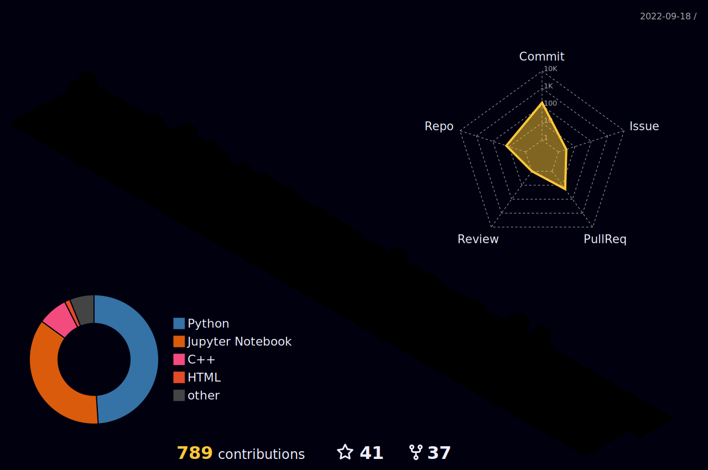

<h1 style="color: red;">Surya Pratap Singh</h1>

Hey there! I'm Surya Pratap Singh, a passionate self-taught web developer and YouTuber from India. I love bringing my ideas to life through elegant projects and paying close attention to the user experience, architecture, and code quality.

## 🎥 YouTube

I create educational content on my YouTube channel, where I share tutorials, tips, and tricks related to web development. Join my community and learn with me on [YouTube](https://www.youtube.com/c/DreamPoint). Don't forget to subscribe to stay updated with the latest videos!

## 💼 Professional Background

I have a strong interest in open-source development and actively contribute to various projects. I'm a firm believer in collaboration and knowledge sharing. Let's build and learn together!

## ⚡ Technologies and Skills

I work with a variety of technologies and have expertise in:

- Front-end: HTML, CSS, JavaScript, React
- Back-end: Python, Django
- Database: MySQL, PostgreSQL
- Version Control: Git, GitHub
- UI/UX Design: Adobe XD, Figma
- Video Editing: Filmora, Kinemaster

**Languages and Tools:**   
<code></code>
<code></code>
<code></code>
<code></code>
<code></code>
<code></code>
<code></code>
<code></code>
<code></code>
<code></code>
<code></code>
<code></code>
<code></code>
<code></code>
<code></code>

## 🌟 Achievements

- Created and maintained several web projects, including e-commerce websites, blogging platforms, and portfolio sites.
- Received positive feedback and appreciation from the developer community for my YouTube tutorials and coding challenges.

## 🌐 Let's Connect

I'm always excited to connect with fellow developers and enthusiasts. Feel free to reach out to me on [LinkedIn](https://www.linkedin.com/in/surya-pratap-singh-288bb4132/) or [GitHub](https://github.com/surya-dream-point). Let's collaborate, learn, and build amazing things together!

- 💼 Any freelance work? Feel free to [contact me](mailto:suryapratap2542@gmail.com) :) 
- 💬 Ask me about anything; I am happy to help! 

  

<picture>
  <source
    media="(prefers-color-scheme: dark)"
    srcset="https://raw.githubusercontent.com/platane/snk/output/github-contribution-grid-snake-dark.svg"
  />
  <source
    media="(prefers-color-scheme: dark)"
    srcset="https://raw.githubusercontent.com/platane/snk/output/github-contribution-grid-snake.svg"
  />
  
</picture>

📈 my github stats  

	
	
		 
	

Thank you for visiting my profile. Happy coding!
